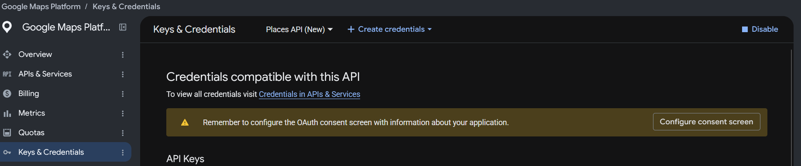

# geolocation

📍 Using the Google Maps API to geolocate place details entities

## Instructions

The purpose of this code is to derive longitude and latitude details from
a set of character strings that is encoded by Google using the
[Google Maps API](https://mapsplatform.google.com/lp/maps-apis/).

For instance

```{r}
#| label: example_tbl
#| echo: false
tibble::tribble(
  ~ID                           , ~Lat , ~Lon  , ~Name                    ,
  "ChIJc1guIZheW0gRLfzDqvPrf8o" , 52.7 , -8.57 , "University of Limerick"
) |>
  knitr::kable()
```

### Getting an API key

To get an API key, you will need to create a developer account on the
[Google Maps API](https://mapsplatform.google.com/lp/maps-apis/) and set up
a billing account.

> You get $300 worth of free credits for making an account.

[Source](https://mapsplatform.google.com/pricing/?utm_experiment=13103223#pay-as-you-go)

Following this, you can create a "Places API (NEW)" key from the
*(Keys and Credentials)* tab of the sidebar



Click on the *+ Create credentials* drop down tab and following the necessary.

**DO NOT SHARE THE API KEY WITH ANYONE**

### Setting up the API key with R

To get the API working with R you will need to run the following code

```{r}
#| label: api-setup
#| echo: true
#| eval: false

usethis::edit_r_environ(scope = "project")
```

This will open a file called *.Renviron* on your screen

Type the following into the file

> GOOGLE_API_KEY = 'MY API KEY'

Make sure you replace *MY API KEY* with your actual API key (keep the single
quotation marks).

Restart R and now the API key will be available in your R session

## Running the script

In the *scripts* folder there is a single R file called *geolocation.R*.

Before running the script you will need to change one thing.

Depending on the dataset you have been given (dataset_1, dataset_2, etc.) you
will need to replace the following code with your associated dataset number.

```{r}
#| label: data-number
#| echo: true
#| eval: false

# Loading the data -------------------------------------------------------------
# What dataset number are you using (1, 2, 3, 4, 5)?
number <- X # REPLACE ME
import_data <- paste0("dataset_", number, ".rds")

places <- readRDS(here::here("data/split/", import_data)) |> pull(place_ID)
```

Replace the X with the associated dataset number

For example

```{r}
#| label: data-number-example
#| echo: false
#| eval: true

tibble::tribble(
  ~dataset        , ~number ,
  "dataset_1.rds" ,       1 ,
  "dataset_2.rds" ,       2 ,
  "dataset_3.rds" ,       3 ,
  "dataset_4.rds" ,       4 ,
  "dataset_5.rds" ,       5 ,
) |>
  knitr::kable()
```

You can run the R script

**It should take approx 2hrs to finish running**
